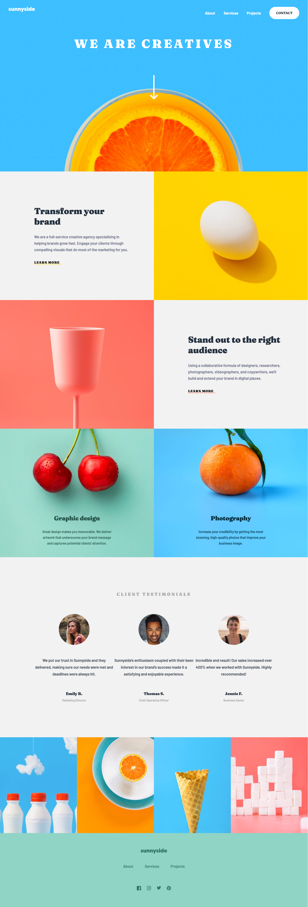

# Sunnyside agency landing page solution

This is a solution to the [Sunnyside agency landing page challenge](https://www.frontendmentor.io/challenges/sunnyside-agency-landing-page-7yVs3B6ef).

## Table of contents

- [Overview](#overview)
  - [The challenge](#the-challenge)
  - [Screenshot](#screenshot)
  - [Links](#links)
- [My process](#my-process)
  - [Built with](#built-with)
  - [What I learned](#what-i-learned)
  - [Useful resources](#useful-resources)
- [Author](#author)

## Overview

### The challenge

Users should be able to:

- View the optimal layout for the site depending on their device's screen size
- See hover states for all interactive elements on the page

### Screenshot

### Links

- Solution URL: [Github](https://github.com/erdemalpay/sunnyside-agency)
- Live Site URL: [Netlify](https://blissful-bassi-3b0120.netlify.app/)

## My process

### Built with

- [Svelte](https://svelte.dev/) - JS library
- [Tailwind CSS](https://tailwindcss.com/) - CSS framework

### What I learned

Common css usage with tailwind framework.
Converting svg images to inline to easily change their colors.
Svelte component slots.

### Useful resources

- [CSS Reference](https://www.cssreference.io) - This helped me for understanding css properties. Examples were really clear.
- [Tailwind Cheat Sheet](https://nerdcave.com/tailwind-cheat-sheet) - This helped me a lot for finding tailwind classes for css properties.

## Author
- Twitter - [@erdemalpay](https://www.twitter.com/erdemalpay)
